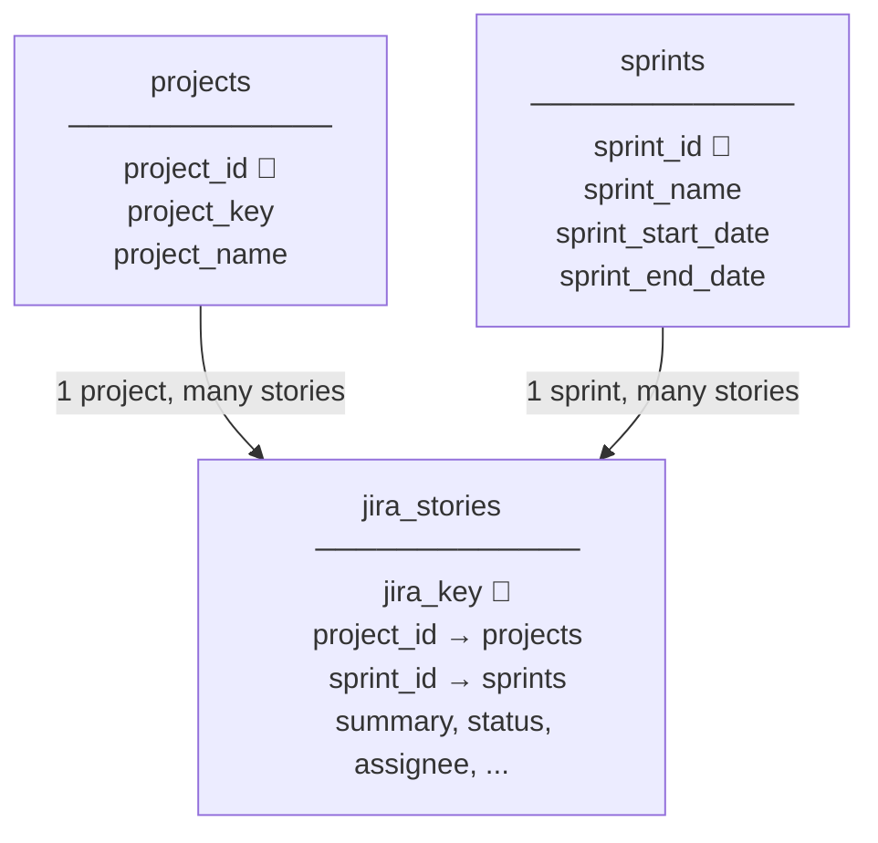

# DSR/WSR Automation DB — ER Diagram

Open this file and press **`Ctrl+Shift+V`** to preview (needs **Markdown Preview Mermaid Support**).

---

## Normalized schema (3 tables)



---

## Your projects (lookup table)

Each project name is stored **once** in `projects`. Stories reference it by numeric `project_id`.

| project_id | project_key | project_name        |
|-----------:|-------------|---------------------|
| 1          | LOC         | LOCO                |
| 2          | COST        | Cost Core Service   |
| 5          | GSS         | GSS                 |
| …          | …           | …                   |

**Why IDs skip (e.g. 1, 2, then 5)?** PostgreSQL `SERIAL` never reuses numbers. IDs 3 and 4 were used by temporary rows during migration/import and then removed. Gaps are normal and do not affect filtering.

Optional cleanup: run `sql/cleanup_duplicate_projects.sql` to remove duplicate project rows.

---

## Your sprint names (lookup table)

Sprint names from Rovo are stored **once globally** in `sprints` (no `project_id`). Examples:

| sprint_id | sprint_name              | belongs to        |
|----------:|--------------------------|-------------------|
| 1         | Nacogdoches - 248        | (project from Rovo) |
| 2         | Q2.13FY26 Eridanus       | (project from Rovo) |
| 3         | Q2.14 FY26 Fornax        | (project from Rovo) |

Sprints are created automatically when you import Rovo JSON — each unique `(project_id, sprint_name)` gets one `sprint_id`.

---

## Example: filter stories by project name

```sql
-- All LOCO stories (join once, filter by name)
SELECT js.jira_key, js.summary, js.status, s.sprint_name
FROM jira_stories js
JOIN projects p ON p.project_id = js.project_id
LEFT JOIN sprints s ON s.sprint_id = js.sprint_id
WHERE p.project_name = 'LOCO';
```

```sql
-- Cost Core Service stories (fast path if you already know project_id = 2)
SELECT * FROM jira_stories WHERE project_id = 2;
```

---

## Example: filter stories by sprint name

```sql
SELECT js.jira_key, p.project_name, js.summary, js.status
FROM jira_stories js
JOIN projects p ON p.project_id = js.project_id
JOIN sprints s ON s.sprint_id = js.sprint_id
WHERE s.sprint_name = 'Q2.13FY26 Eridanus';
```

```sql
-- GSS stories in a specific sprint (by numeric ids — fastest)
SELECT js.*
FROM jira_stories js
WHERE js.project_id = 3
  AND js.sprint_id = 2;
```

---

## Apply schema and import data

```powershell
python -m alembic upgrade head
python scripts/seed_from_rovo.py "path\to\rovo-response.json"
python scripts/check_schema.py
```

Rovo import maps each story’s `project_name` / `project_key` → `project_id` and `sprint_name` → `sprint_id` automatically.
